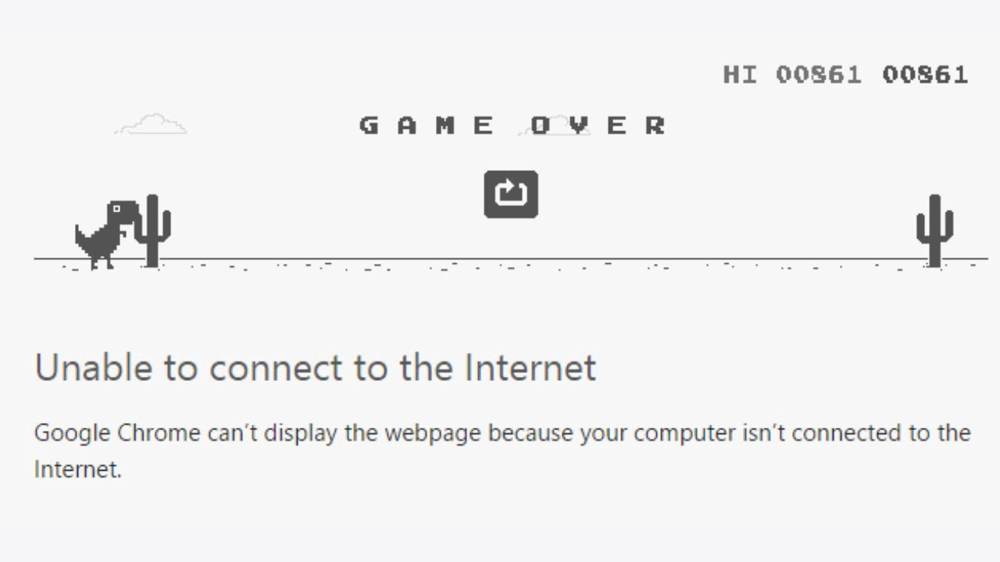
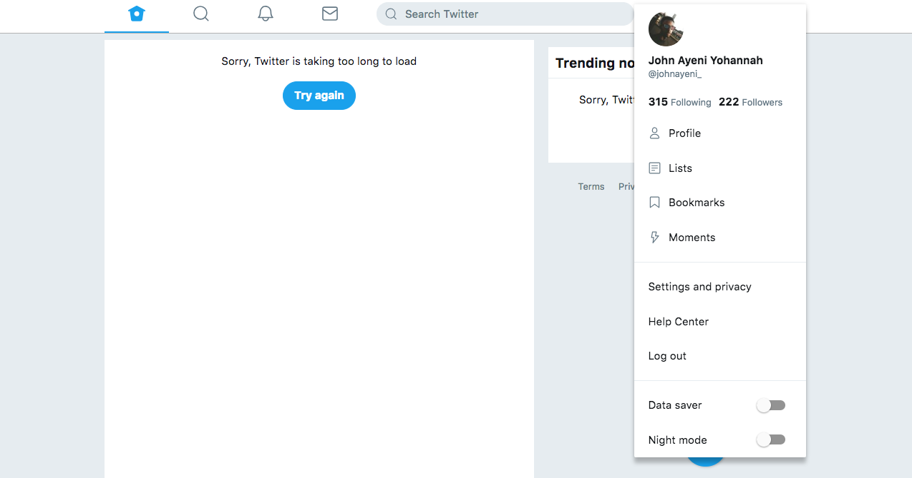
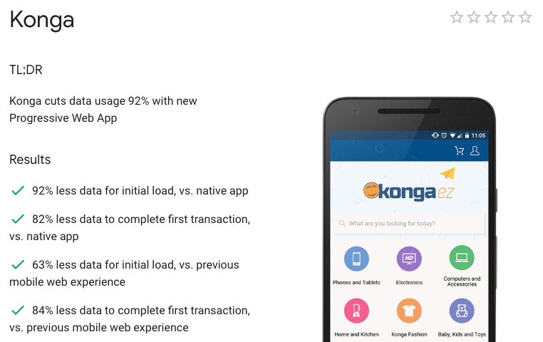
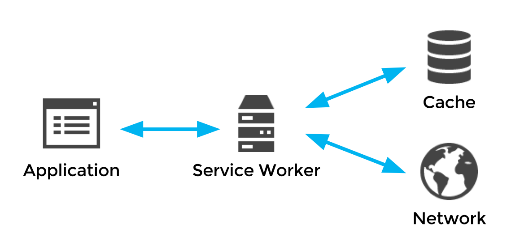

_Progressive Web App (PWA) is a term used to denote a new software development methodology. Unlike traditional applications, progressive web apps are a hybrid of regular web pages (or websites) and a mobile application._

### Compare this with no network



### To this



PWAs utilize the power of the Service workers and other tools like the browser Cache and IndexedDB to provide users with a better web experience or sometimes, an offline first experience.
Offline first experience? how? what does that even mean? Imagine opening a web app online where you see random quotes, and then even when you are offline, you still get quotes on the page. Cool right? Imagine the app has pictures and you get this pictures even when offline. PWAs help in alot of ways, page load speed, use of less internet data, better user experience, basically bring the mobile native feel to a web app.
The main goal of PWAs is tho mimic awsesome features of native apps e.g offline capability, accessiblity from home screen e.t.c and use them to power web apps.
Web apps are far more accessible to users and are easily disposable unlike native apps.



## The Service Worker

PWAs wouldn’t currently be possible without the help of the Service Worker. A service worker is a script that your browser runs in the background, separate from a web page, opening the door to features that don’t need a web page or user interaction. Today, they already include features like push [notifications](https://developers.google.com/web/updates/2015/03/push-notifications-on-the-open-web) and [background sync](https://developers.google.com/web/updates/2015/12/background-sync).



A service worker can be registered in your app like this

```js
if (navigator.serviceWorker) {
  navigator.serviceWorker
    .register("/sw.js")
    .then(() => {
      console.log("Service worker registered")
    })
    .catch(e => {
      console.log("Service worker registeration failed")
    })
}
```

Read more on service wokers [here](https://developers.google.com/web/fundamentals/primers/service-workers/)

## Browser Cache API

The CacheStorage interface represents the storage for Cache objects.

### The interface:

Provides a master directory of all the named caches that can be accessed by a `ServiceWorker` or other type of worker or window scope (you’re not limited to only using it with service workers, even though the Service Workers spec defines it).
Maintains a mapping of string names to corresponding `Cache` objects.
Use `CacheStorage.open()` to obtain a Cache instance.

Use `CacheStorage.match()` to check if a given Request is a key in any of the Cache objects that the CacheStorage object tracks.

## IndexedDB API - (Cool but optional)

Another cool tool you can use for PWAs is the IndexedDB. IndexedDB is a large-scale, NoSQL storage system. It lets you store just about anything in the user’s browser. you can use IndexedDB to store data for offline usage for users. Click [here](https://developers.google.com/web/ilt/pwa/working-with-indexeddb) to learn more about IndexedDb.
