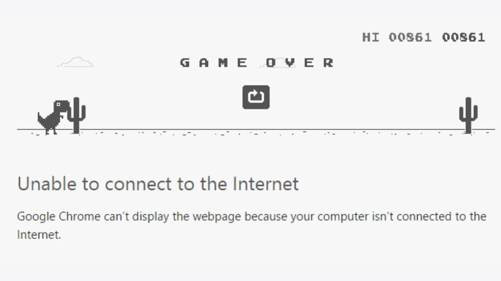
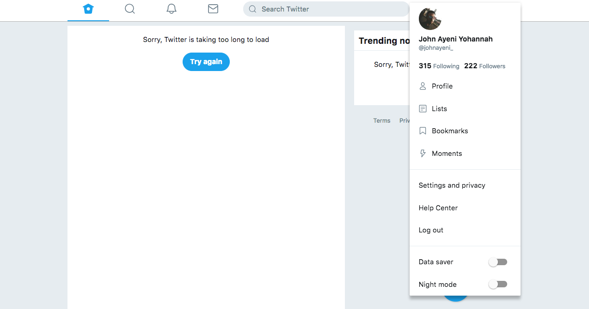
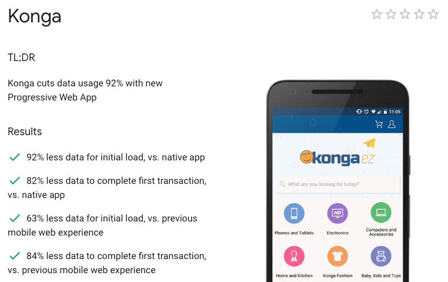
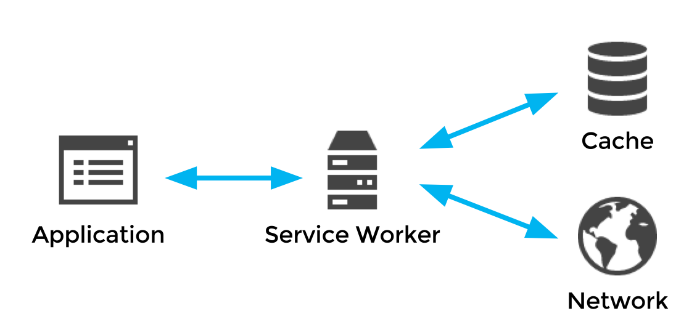
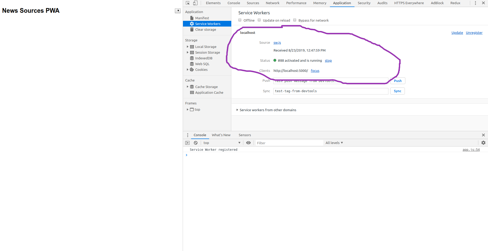
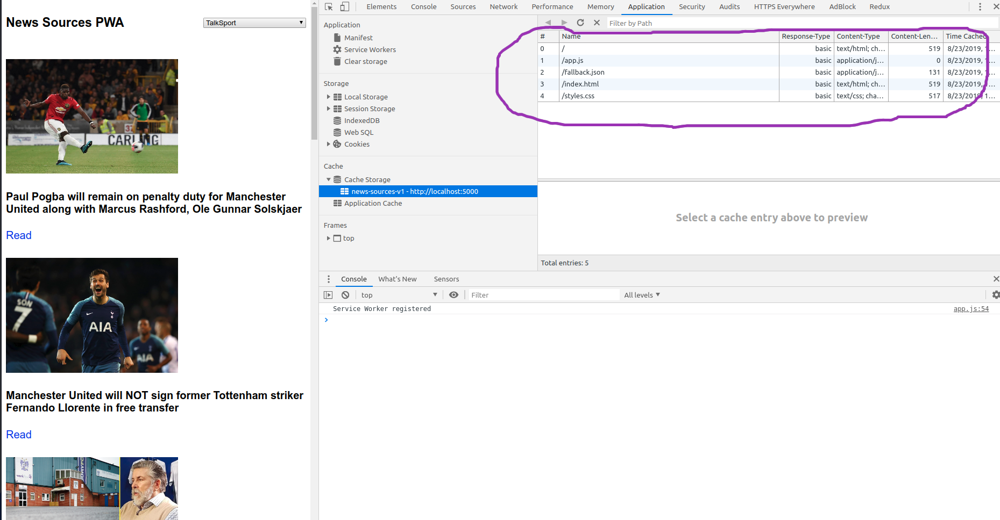
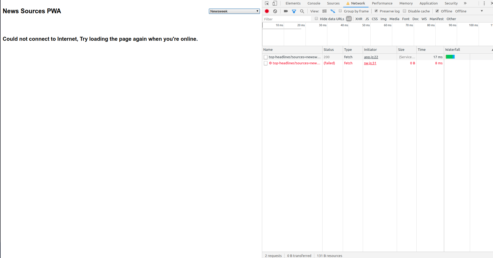
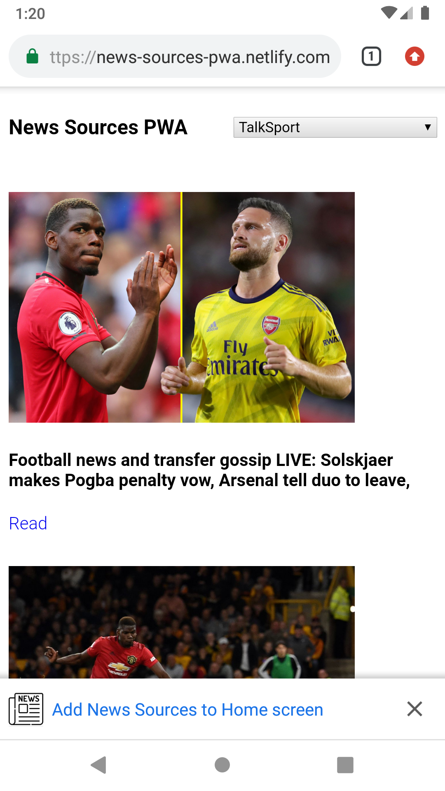
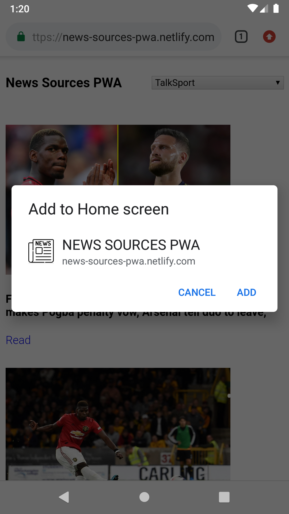

[Code Repo](https://github.com/johnayeni/news-sources-pwa/)


_Progressive Web App (PWA) is a term used to denote a web software development methodology. Unlike traditional web applications, progressive web apps are a hybrid of regular web pages (or websites) and a mobile/Desktop application._

### Compare this with no network



### To this with still no network



PWAs utilize the power of the Service worker and other tools like the browser Cache and IndexedDB APIs to provide users with a better web experience or sometimes, an offline first experience.
Offline first experience? how? what does that even mean? Imagine opening a web app online where you see random quotes, and then even when you are offline, you still get quotes on the page. Cool right? Imagine the app has pictures and you get this pictures even when offline. PWAs help in alot of ways, page load speed, use of less internet data, better user experience, basically bring the mobile native feel to a web app.
The main goal of PWAs is tho mimic awsesome features of native apps e.g offline capability, accessiblity from home screen e.t.c and use them to power web apps.
Web apps are far more accessible to users and are easily disposable unlike native apps. PWAs as of now are installable on Android devices with chrome, on IOS with safari and on Desktop PCs with Chrome.



## The Service Worker

PWAs wouldn’t currently be possible without the help of the Service Worker. A service worker is a script that your browser runs in the background, separate from a web page, opening the door to features that don’t need a web page or user interaction. Today, they already include features like push [notifications](https://developers.google.com/web/updates/2015/03/push-notifications-on-the-open-web) and [background sync](https://developers.google.com/web/updates/2015/12/background-sync).



A service worker can be registered in your app like this


```js
if (navigator.serviceWorker) {
  navigator.serviceWorker
    .register("/sw.js")
    .then(() => {
      console.log("Service worker registered")
    })
    .catch(e => {
      console.log("Service worker registeration failed")
    })
}
```


Read more on service wokers [here](https://developers.google.com/web/fundamentals/primers/service-workers/)

## Browser Cache API

The CacheStorage interface represents the storage for Cache objects.

### The interface:

Provides a master directory of all the named caches that can be accessed by a `ServiceWorker` or other type of worker or window scope (you’re not limited to only using it with service workers, even though the Service Workers spec defines it).
Maintains a mapping of string names to corresponding `Cache` objects.

## IndexedDB API

Another cool tool you can use for PWAs is the IndexedDB. IndexedDB is a large-scale, NoSQL storage system. It lets you store just about anything in the user’s browser. you can use IndexedDB to store data for offline usage for users. Click [here](https://developers.google.com/web/ilt/pwa/working-with-indexeddb) to learn more about IndexedDb.

## Lets write some code

We are going to be building a simple PWA using the [News Api](https://newsapi.org/)
This app requires Node Js (version 8.11 or higher prefered) to be installed on your machine.

There is a starter code which can be dowloaded or cloned [here](https://github.com/johnayeni/news-sources-pwa/tree/start)

Our app has a file structure like this


```
news-sources-pwa
  - images
    - Icons // contains icons for the app manifest
  app.js
  fallback.json
  index.html
  manifest.json
  package.json
  style.js
  sw.js
```


### The App shell

An application shell (or app shell) architecture is one way to build a Progressive Web App that reliably and instantly loads on your users' screens, similar to what you see in native applications. ... This means the application shell is not loaded from the network every time the user visits.

To make this we are going to make a simple structure in our `index.html` file for our app structure


```html
<!DOCTYPE html>
<html lang="en">
  <head>
    <meta charset="UTF-8" />
    <title>News Sources PWA</title>
    <meta name="viewport" content="width=device-width, initial-scale=1.0" />

    <link rel="stylesheet" href="styles.css" />
    <link rel="manifest" href="manifest.json" />
    <meta name="theme-color" content="#ffffff" />
  </head>

  <body>
    <header>
      <h3>News Sources PWA</h3>
      <select id="sources"></select>
    </header>
    <main></main>
    <script src="app.js"></script>
  </body>
</html>
```


## Registering a Service Worker

Edit the `app.js` file register a service worker file


```js
if ("serviceWorker" in navigator) {
  window.addEventListener("load", () =>
    navigator.serviceWorker
      .register("sw.js")
      .then(reg => console.log("Service Worker registered"))
      .catch(err => `SW registration failed: ${err.message}`)
  )
}
```


Make sure you have the `package.json` from the starter file which should contain This


```json
{
  "name": "news-sources-pwa",
  "version": "1.0.0",
  "description": "A simple pwa example.",
  "scripts": {
    "start": "serve -l 5000",
    "test": "echo \"Error: no test specified\" && exit 1"
  },
  "repository": {
    "type": "git",
    "url": "git+https://github.com/johnayeni/news-sources-pwa.git"
  },
  "author": "John Ayeni",
  "license": "ISC",
  "bugs": {
    "url": "https://github.com/johnayeni/news-sources-pwa/issues"
  },
  "homepage": "https://github.com/johnayeni/news-sources-pwa#readme",
  "dependencies": {
    "serve": "^11.1.0"
  }
}
```

To run the app simple run `npm install` then `npm start` on your terminal or command line

The app should be running on `http://localhost:5000`

Open the app on Chrome and then open dev-tools. Check the applications tab and click on service worker.
A service worker should be up and running



### Fetching the news sources and articles

We need to populate our app with data.

Register an account on [News Api](https://newsapi.org/) and get an API key.

The we will use Jaascript to fetch out data. Edit the `app.js` file to have this.


```js
const apiKey = "YOUR_NEWS_API_KEY"
const DEFALT_SOURCE = "talksport"
const sourceOptions = document.querySelector("#sources")
const mainContainer = document.querySelector("main")

const updateNewsSources = async () => {
  try {
    const response = await fetch(
      `https://newsapi.org/v2/sources?apiKey=${apiKey}`
    )
    const { sources } = await response.json()
    sourceOptions.innerHTML = sources
      .map(source => `<option value="${source.id}">${source.name}</option>`)
      .join("\n")
  } catch (error) {
    window.alert("Error connecting to the internet")
  }
}

const updateNews = async (source = DEFALT_SOURCE) => {
  try {
    const response = await fetch(
      `https://newsapi.org/v2/top-headlines?sources=${source}&sortBy=top&apiKey=${apiKey}`
    )
    const { articles } = await response.json()
    mainContainer.innerHTML = articles.map(createArticleHtml).join("\n")
  } catch (error) {
    window.alert("Error fetching articles")
  }
}

const createArticleHtml = article => {
  return `
  <div class="article">
    ${
      article.urlToImage
        ? ''
        : ""
    }
    <h4>${article.title}</h4>
    <a href="${article.url}" target="_blank">${article.url ? "Read" : ""}</a>
  </div>
  `
}

if ("serviceWorker" in navigator) {
  window.addEventListener("load", () =>
    navigator.serviceWorker
      .register("sw.js")
      .then(reg => console.log("Service Worker registered"))
      .catch(err => `SW registration failed: ${err.message}`)
  )
}

window.addEventListener("load", async e => {
  sourceOptions.addEventListener("change", evt => updateNews(evt.target.value))
  await updateNewsSources()
  sourceOptions.value = DEFALT_SOURCE
  updateNews()
})

window.addEventListener("online", () => updateNews(sourceOptions.value))
```


In our `app.js` file now, we fetch a list of news sources form the API and set them on the select input with `updateNewsSources`. The we fetch a list of articles from a default source initially with `updateNews`.
We added an event listener to the select input so that when the user selects a new source, we fetch the articles for that source.

### Offline capability

Next we need to make our app work offline. The service worker will handle this.

First we need to cache static resources when our service worker is activated, edit `sw.js`


```js
const cacheName = "news-sources-v1"

const staticAssets = [
  "./",
  "./index.html",
  "./app.js",
  "./styles.css",
  "./fallback.json",
]

self.addEventListener("install", async () => {
  const cache = await caches.open(cacheName)
  cache.addAll(staticAssets)
})

self.addEventListener("activate", event => {
  event.waitUntil(self.clients.claim())
})
```


As you can see above, we listed the files which we need for our app shell and cached them once the service worker installs
The cache name is also in form of a version number, this is usefull for pushing updates when the resources needed for the app shell have been changed

Next we need to listen to `fetch` events from the app. If the origin of the request is the same with our app, we will first check the cache if we have that resource and respond with that. If not, we can then fetch from the network.
If the origin is not the same with our app, we will check the network and if that fails we respond with a fallback.

The approach for origins from our app is called a `CacheFirst` Approach.
The approach for origins not from our app is called a `NetworkFirst` Approach.

To implement our `CacheFirst` and `NetworkFirst` approaches, the `sw.js` file should now be this.


```js
const cacheName = "news-sources-v1"

const staticAssets = [
  "./",
  "./index.html",
  "./app.js",
  "./styles.css",
  "./fallback.json",
]

self.addEventListener("install", async () => {
  const cache = await caches.open(cacheName)
  cache.addAll(staticAssets)
})

self.addEventListener("activate", event => {
  event.waitUntil(self.clients.claim())
})

self.addEventListener("fetch", event => {
  const request = event.request
  const url = new URL(request.url)
  if (url.origin === location.origin) {
    event.respondWith(cacheFirst(request))
  } else {
    event.respondWith(networkFirst(request))
  }
})

const cacheFirst = async request => {
  const cachedResponse = await caches.match(request)
  return cachedResponse || fetch(request)
}

const networkFirst = async request => {
  try {
    const networkResponse = await fetch(request)
    return networkResponse
  } catch (err) {
    const cacheResponse = await caches.match("./fallback.json")
    return cacheResponse
  }
}
```


Reload the app check the applications tab on the dev-tools. The apps static resources should be cached



### Installability

To finish our app, we need to make it installable. To acheive this we need to fill out our manifest file.

The web app manifest provides information about a web application in a JSON text file, necessary for the web app to be downloaded and be presented to the user similarly to a native app (e.g., be installed on the homescreen of a device, providing users with quicker access and a richer experience). PWA manifests include its name, author, icon(s), version, description, and list of all the necessary resources (among other things).

The starter code given, already has icons needed for the app. Next we just need to fill in details for our manifest file, which is `manifest.json`


```json
{
  "name": "NEWS SOURCES PWA",
  "short_name": "News Sources",
  "theme_color": "#ffffff",
  "background_color": "#ffffff",
  "display": "standalone",
  "Scope": "/",
  "start_url": "/",
  "icons": [
    {
      "src": "images/icons/icon-72x72.png",
      "sizes": "72x72",
      "type": "image/png"
    },
    {
      "src": "images/icons/icon-96x96.png",
      "sizes": "96x96",
      "type": "image/png"
    },
    {
      "src": "images/icons/icon-128x128.png",
      "sizes": "128x128",
      "type": "image/png"
    },
    {
      "src": "images/icons/icon-144x144.png",
      "sizes": "144x144",
      "type": "image/png"
    },
    {
      "src": "images/icons/icon-152x152.png",
      "sizes": "152x152",
      "type": "image/png"
    },
    {
      "src": "images/icons/icon-192x192.png",
      "sizes": "192x192",
      "type": "image/png"
    },
    {
      "src": "images/icons/icon-384x384.png",
      "sizes": "384x384",
      "type": "image/png"
    },
    {
      "src": "images/icons/icon-512x512.png",
      "sizes": "512x512",
      "type": "image/png"
    }
  ],
  "splash_pages": null
}
```


Read more on the web app manifest [here](https://developer.mozilla.org/en-US/docs/Web/Manifest)

### Our PWA is ready

We have successfully built a simple PWA. If we go to the network tab on dev-tools, you can select an option which says `offline`
This cuts our app off from the network, and if we select another news source or reload our app, our app still responds with content saying we could not connect to the internet.



On Android phones, chrome will show a prompt, when our app is opened, to add it home screen. This can also be done manually from the context menu.




This is not so on iOS devices, but the app can still be manually added to the home screen, buy clicking on the share option in safari and selecting `Add the home screen`

Get the complete source code for the app [Here](https://github.com/johnayeni/news-sources-pwa/) on github
